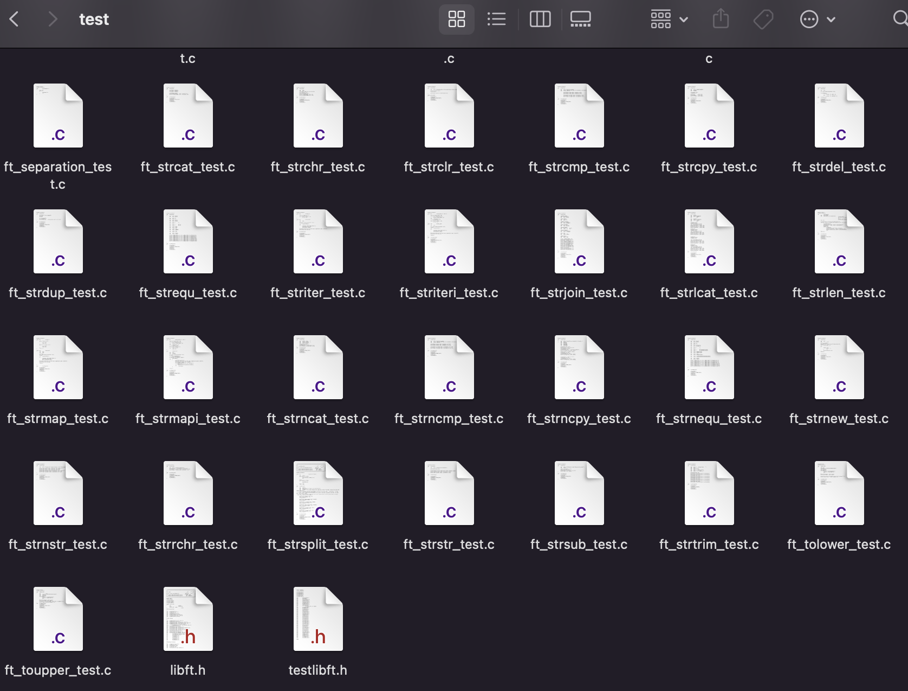

# testlibft

Simple tester with a simple goal in mind : test function for a library project.

⚠️  Tests are not official ⚠️ , just to give an idea of your results. Do your own for more accuracy.


##Installation


Clone on your computer

```bash
git@github.com:B9R9/testlibft.git
```

Paste your libft files in the srcs directory.


Add your header files to the tests directory.
  

Launch the program

```bash
make run
```
Have fun with it.


### Contributors
- Baptiste (https://github.com/B9R9)
- Gabor (https://github.com/mobahug)
- Clement (https://github.com/wdclem)


